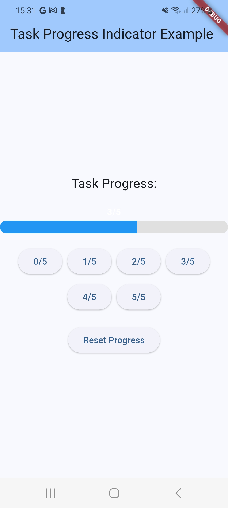

# Task Progress Indicator

A Flutter package that provides a customizable progress indicator for tracking task completion, with built-in platform-specific persistence.

## Features

- 🎨 Customizable progress bar widget
- 📱 Platform-specific persistence
- 🎯 Simple and intuitive API
- 🎨 Material Design support
- 🔄 Progress state management
- 💾 Automatic data persistence

## Screenshot



## Installation

Add the package to your `pubspec.yaml`:

```yaml
dependencies:
  task_progress_indicator: ^0.0.1
```

Then run:
```bash
flutter pub get
```

## Usage

### Basic Progress Bar

```dart
import 'package:task_progress_indicator/task_progress_indicator.dart';

// Create a progress indicator
final progress = TaskProgressIndicator(
  completed: 3,
  total: 5,
  color: Colors.blue,
  backgroundColor: Colors.grey[200]!,
);

// Use it in your widget
TaskProgressBar(
  progress: progress,
  height: 8.0,
  showText: true,
  textStyle: TextStyle(fontSize: 14),
  borderRadius: 4.0,
)
```

### Managing Progress

```dart
import 'package:task_progress_indicator/task_progress.dart';

// Create a progress manager
final taskProgress = TaskProgress();

// Update progress
await taskProgress.updateProgress(
  completed: 3,
  total: 5,
);

// Get current progress
final current = taskProgress.currentProgress;
print(current.percentage); // 0.6
print(current.text); // "3/5"

// Load saved progress
final saved = await taskProgress.loadProgress();

// Clear progress
await taskProgress.clearProgress();
```

### Complete Example

```dart
import 'package:flutter/material.dart';
import 'package:task_progress_indicator/task_progress_indicator.dart';
import 'package:task_progress_indicator/task_progress.dart';

class TaskProgressExample extends StatefulWidget {
  const TaskProgressExample({super.key});

  @override
  State<TaskProgressExample> createState() => _TaskProgressExampleState();
}

class _TaskProgressExampleState extends State<TaskProgressExample> {
  final TaskProgress _taskProgress = TaskProgress();
  late TaskProgressIndicator _progress;

  @override
  void initState() {
    super.initState();
    _loadProgress();
  }

  Future<void> _loadProgress() async {
    final saved = await _taskProgress.loadProgress();
    setState(() {
      _progress = saved ?? TaskProgressIndicator(completed: 0, total: 5);
    });
  }

  Future<void> _updateProgress(int completed) async {
    await _taskProgress.updateProgress(
      completed: completed,
      total: 5,
    );
    setState(() {
      _progress = TaskProgressIndicator(
        completed: completed,
        total: 5,
      );
    });
  }

  @override
  Widget build(BuildContext context) {
    return Column(
      children: [
        TaskProgressBar(
          progress: _progress,
          height: 8.0,
          showText: true,
        ),
        const SizedBox(height: 16),
        Row(
          mainAxisAlignment: MainAxisAlignment.spaceEvenly,
          children: [
            for (int i = 0; i <= 5; i++)
              ElevatedButton(
                onPressed: () => _updateProgress(i),
                child: Text('$i/5'),
              ),
          ],
        ),
      ],
    );
  }
}
```

## Configuration

### TaskProgressIndicator

| Parameter | Type | Default | Description |
|-----------|------|---------|-------------|
| completed | int | required | Number of completed tasks |
| total | int | required | Total number of tasks |
| color | Color | Colors.blue | Progress bar color |
| backgroundColor | Color | Colors.grey[200] | Background color |

### TaskProgressBar

| Parameter | Type | Default | Description |
|-----------|------|---------|-------------|
| progress | TaskProgressIndicator | required | Progress data |
| height | double | 4.0 | Height of the progress bar |
| showText | bool | true | Whether to show progress text |
| textStyle | TextStyle? | null | Custom text style |
| borderRadius | double? | null | Border radius of the progress bar |

## Platform Support

The package provides platform-specific persistence through the `TaskProgress` class:

- Android: Uses SharedPreferences
- iOS: Uses NSUserDefaults
- Web: Uses localStorage
- Other platforms: Uses a memory-based fallback

## Contributing

Contributions are welcome! Please feel free to submit a Pull Request.

## License

This project is licensed under the MIT License - see the [LICENSE](LICENSE) file for details.
